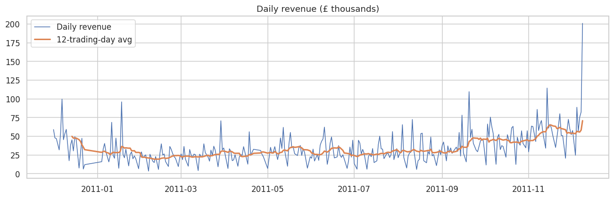
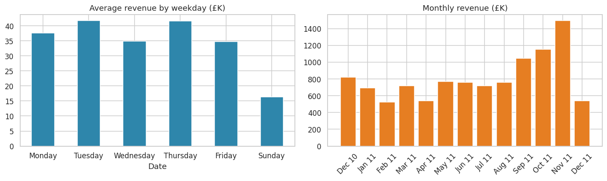
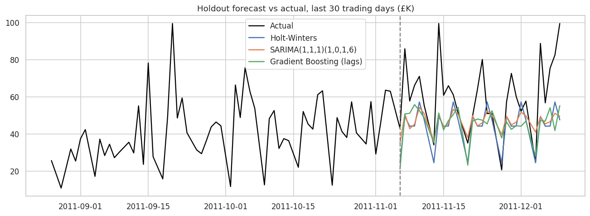
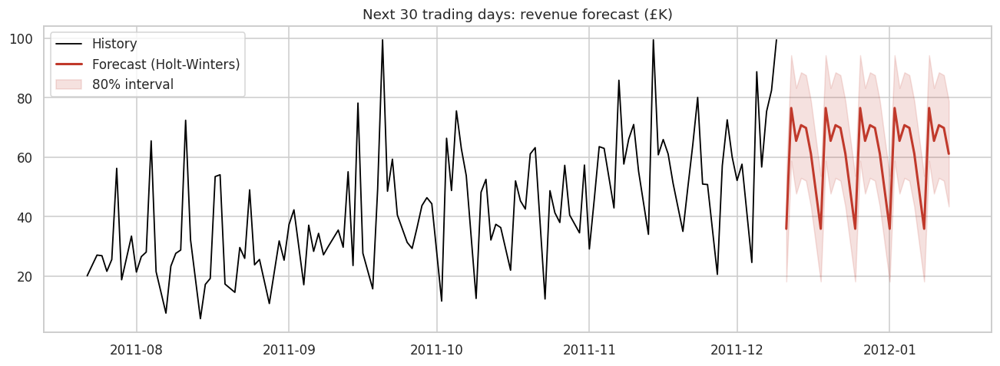

# 📈 Retail Sales Forecasting (Time Series)

  

**Business problem:** a UK online retailer needs a **30-day revenue forecast** to plan stock and staffing for the holiday season. I built and compared **5 forecasting approaches**, from simple baselines to statistical and machine-learning models, and produced a forecast with prediction intervals.

## 📊 Data
Daily revenue built from the [UCI Online Retail](https://archive.ics.uci.edu/dataset/352/online+retail) transactions (Dec 2010 – Dec 2011, cancellations removed): **305 trading days**. The store doesn't trade on Saturdays, so the series is modelled on trading days with a **6-day weekly cycle**.

## 🛠️ Approach
1. **EDA:** trend, weekday pattern, monthly totals, seasonal decomposition, ADF stationarity test
2. **Data issue fixed:** 9 Dec 2011 included an 80,995-unit order (£168K) that was cancelled straight away. It was capped at the 99th percentile.
3. **Holdout test:** the last **30 trading days** (mid-Nov → Dec, peak season)
4. **Models compared:**
   - Seasonal naive (same weekday last week) and 24-day moving average (baselines)
   - **Holt-Winters** exponential smoothing (damped additive trend + 6-day seasonality)
   - **SARIMA**(1,1,1)(1,0,1,6)
   - **Gradient Boosting** with lag, rolling-mean and calendar features (recursive multi-step forecast)
5. **Final forecast:** best model refit on all data, **30 trading days ahead with an 80% interval**, exported to CSV

## 🏆 Results (holdout: last 30 trading days)
| Model | MAE (£) | MAPE |
|---|---|---|
| **Holt-Winters** ✅ | 17,514 | **25.7%** |
| SARIMA(1,1,1)(1,0,1,6) | **17,014** | 26.7% |
| Gradient Boosting (lags) | 17,469 | 27.2% |
| Seasonal Naive | 18,455 | 29.3% |
| Moving Average (24d) | 21,705 | 35.0% |

**Forecast:** about **£1.9M over the next 30 trading days** (80% range £1.37M–£2.43M) → [`output/forecast_next_30_trading_days.csv`](output/forecast_next_30_trading_days.csv)

## 📈 Visuals


| Weekday & monthly pattern | Holdout forecast vs actual |
|---|---|
|  |  |



## 💡 Insights
- Revenue **grows steeply from September to November**, the holiday gifting season.
- **Tuesday and Thursday** are the busiest days (~£41.6K on average), **Sunday** the quietest (~£16.3K). This matters for warehouse staffing.
- A simple, explainable **Holt-Winters** model beats the baselines by 4–9 MAPE points and matches ML on a short series.
- **Limitation:** with only one year of history, yearly seasonality (the post-Christmas slump) can't be learned. The model should be retrained as more data arrives.

## ▶️ How to run
```bash
pip install -r requirements.txt
jupyter notebook sales_forecasting.ipynb
```

---
👤 **Ansh Rai**, Data Analyst · [LinkedIn](https://www.linkedin.com/in/anshrai-adr) · [GitHub](https://github.com/ANSHRAI21) · [Portfolio](https://a-s-pyratech-solutions.space)
